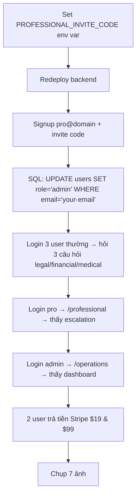

# TẠO TÀI KHOẢN ADMIN & PROFESSIONAL (CHO SCREENSHOT)

> **Tóm tắt:** Hệ thống có 3 role: `individual` (mặc định), `professional`, `admin`. Không tự đăng ký được admin. Professional cần **invite code**.

---

## 0. CÁCH DỄ NHẤT — TỰ NÂNG QUYỀN QUA EMAIL (không cần SQL, không cần shell)

Mình đã thêm 2 biến env `ADMIN_EMAILS` và `PROFESSIONAL_EMAILS`. Chỉ cần đặt email vào đó, rồi đăng ký/đăng nhập tài khoản đó → tự động thành `admin` / `professional`.

> **Lưu ý:** Admin xem được CẢ `/operations` LẪN `/professional`. Nên chỉ cần 1 tài khoản admin là đủ cho ảnh 4 + 5.

**Bước 1 — Set env trên production (Render/Railway/Cloud Run → Environment Variables):**
```bash
ADMIN_EMAILS=admin@yourdomain.com
PROFESSIONAL_EMAILS=pro@yourdomain.com
```
> Sau khi set, nhớ **redeploy / restart** backend.

**Bước 2 — Đăng ký tài khoản thường qua UI `/signup`** với đúng email đó (vd `admin@yourdomain.com`, password bất kỳ).

**Bước 3 — Đăng nhập lại:** tài khoản đó đã là `admin` / `professional`. Mở `/operations` (ảnh 5) và `/professional` (ảnh 4).

---

## 1. PROFESSIONAL ACCOUNT (cho ảnh 4: `/professional`)

### Cách 1: Dùng Invite Code (Khuyên dùng - nhanh nhất)

**Bước 1: Set env var trên production**
```bash
# Render/Railway/Cloud Run dashboard → Environment Variables
PROFESSIONAL_INVITE_CODE=expertai-pro-2026-secret-code
```
> Mã này tự tạo, chỉ bạn biết. Nhớ **redeploy** backend sau khi set.

**Bước 2: Đăng ký qua UI**
1. Mở production URL → `/signup`
2. Điền:
   - Email: `pro@yourdomain.com`
   - Password: `Password123!`
   - Name: `Professional User`
   - **Role:** Chọn `professional` (dropdown)
   - **Professional Title:** `Attorney at Law` / `CPA` / `Physician`
   - **Professional License:** `BAR-12345` / `CPA-67890` / `MD-11111`
   - **Professional Invite Code:** `expertai-pro-2026-secret-code` (y hệt env var)

3. Bấm **Sign Up** → tự động login với role `professional`

**Bước 3: Vào `/professional`**
- Mở production URL → `/professional`
- Sẽ thấy: **Available Referrals** (escalation chưa ai claim)
- Click 1 case → hiện **Case Summary** → **CHỤP ẢNH 4**

---

### Cách 2: Sửa database trực tiếp (nếu không muốn dùng invite code)

**Chạy SQL trên production database:**
```sql
-- Tìm user vừa đăng ký
SELECT id, email, role FROM users WHERE email = 'pro@yourdomain.com';

-- Update role thành professional
UPDATE users 
SET role = 'professional',
    professional_title = 'Attorney at Law',
    professional_license = 'BAR-12345'
WHERE email = 'pro@yourdomain.com';
```

---

## 2. ADMIN ACCOUNT (cho ảnh 5: `/operations`)

> **Không có UI đăng ký admin.** Phải sửa database trực tiếp.

### Cách duy nhất: SQL trên production database

**Kết nối production DB (pgAdmin / DBeaver / Railway CLI / Render shell):**

```sql
-- Tạo user admin mới (khuyên dùng: email riêng)
INSERT INTO users (id, email, hashed_password, name, role, created_at, updated_at)
VALUES (
    gen_random_uuid(),
    'admin@yourdomain.com',
    '$2b$12$...hash_của_Password123!...',  -- xem dưới để gen hash
    'Admin User',
    'admin',
    NOW(),
    NOW()
);

-- HOẶC: Nâng cấp user hiện có thành admin
UPDATE users 
SET role = 'admin'
WHERE email = 'your-email@gmail.com';
```

### Gen password hash (chạy 1 lần local):

```bash
# Option A: Python (nếu có python)
cd backend
python -c "from auth import hash_password; print(hash_password('Password123!'))"

# Option B: Online bcrypt generator
# https://bcrypt-generator.com/ → nhập "Password123!" → copy hash
```

**Kết quả hash ví dụ:** `$2b$12$LQv3c1yqBWVHxkd0LHAkCOYz6TtxMQJqhN8/LewdBPj/RK.PZvO.S`

### Sau khi chạy SQL:
1. Mở production URL → `/signin`
2. Đăng nhập: `admin@yourdomain.com` / `Password123!`
3. Vào `/operations` → **CHỤP ẢNH 5**

---

## 3. TẠO DỮ LIỆU TEST CHO 7 ẢNH (QUAN TRỌNG)

Bạn cần có **data thật** trong production để chụp đẹp. Làm theo thứ tự:

### Bước A: Tạo 3 user thường (individual)
```bash
# Đăng ký 3 tài khoản qua UI /signup
user1@gmail.com / Password123! / "Nguyen Van A"
user2@gmail.com / Password123! / "Tran Thi B"  
user3@gmail.com / Password123! / "Le Van C"
```

### Bước B: Mỗi user hỏi 1-2 câu hỏi (tạo data cho ảnh 1,2,3)

**User 1 (Legal):**
```
"Chủ nhà giữ tiền đặt cọc 2 tháng không trả, tôi có quyền kiện không? 
Tôi ở California, hợp đồng thuê 1 năm."
```

**User 2 (Financial):**
```
"Tôi làm freelance năm đầu, thu nhập $80k. Phải nộp thuế dự trữ quý như thế nào?
Có khấu trừ home office không?"
```

**User 3 (Medical - sẽ trigger escalation):**
```
"Đau ngực lan xuống tay trái, khó thở, mồ hôi lạnh. 
Đang ngồi làm việc bất ngờ bị vậy."
```

### Bước C: User 3 sẽ bị escalation → hiện lên `/professional`

1. Login `pro@yourdomain.com` → `/professional`
2. Sẽ thấy case của User 3 với status **pending**
3. Click → xem **Case Summary** → **CHỤP ẢNH 4**

### Bước D: Admin claim & resolve (tạo data cho ảnh 5)

1. Login `admin@yourdomain.com` → `/operations`
2. Sẽ thấy: Total queries, Escalation rate, AI resolution rate
3. **CHỤP ẢNH 5**

### Bước E: Stripe test (ảnh 6)

1. Login `user1@gmail.com` → `/pricing` → chọn **Individual $19/mo** → thanh toán Stripe test card
   - Card: `4242 4242 4242 4242` | 12/34 | 123 | ZIP: 12345
2. Login `user2@gmail.com` → chọn **Professional $99/mo** → thanh toán
3. Vào `dashboard.stripe.com` (LIVE mode) → Payments → **CHỤP ẢNH 6**

---

## 4. CHECKLIST TRƯỚC KHI CHỤP

| Role | Email | Password | Đã tạo? | Đã login được? | URL test |
|------|-------|----------|---------|----------------|----------|
| Individual 1 | user1@gmail.com | Password123! | ☐ | ☐ | `/query/[id]` |
| Individual 2 | user2@gmail.com | Password123! | ☐ | ☐ | `/pricing` → Stripe |
| Individual 3 | user3@gmail.com | Password123! | ☐ | ☐ | `/query/[id]` (escalation) |
| Professional | pro@yourdomain.com | Password123! | ☐ | ☐ | `/professional` |
| Admin | admin@yourdomain.com | Password123! | ☐ | ☐ | `/operations` |

---

## 5. KHẮC PHỤC LỖI THƯỜNG GẶP

| Lỗi | Nguyên nhân | Sửa |
|-----|-------------|-----|
| "Professional onboarding requires a valid invitation" | Invite code sai hoặc chưa set env | Check `PROFESSIONAL_INVITE_CODE` y hệt trên production |
| "Administrative accounts cannot be self-registered" | Thử signup role admin qua UI | Phải dùng SQL `UPDATE users SET role='admin'` |
| `/operations` trả 403 | User không phải admin | Check `SELECT role FROM users WHERE email='...'` |
| `/professional` trả 403 | User không phải professional | Check role + `professional_title`, `license` không null |
| Không thấy escalation trên `/professional` | Chưa có query trigger escalation | User 3 hỏi câu medical emergency (xem Bước B) |
| Stripe không hiện payment | Dùng test mode hoặc webhook chưa config | Chuyển Stripe sang **Live mode**, check `STRIPE_WEBHOOK_SECRET` |

---

## 6. SCRIPT TỰ ĐỘNG (CHẠY 1 LẦN TRÊN PRODUCTION SHELL)

Nếu có shell access (Render/Railway/Cloud Run), chạy script này:

```bash
cd backend
python << 'EOF'
import os
import sys
sys.path.insert(0, '.')
from database import SessionLocal
from models import User
from auth import hash_password
from config import PROFESSIONAL_INVITE_CODE

db = SessionLocal()
try:
    # 1. Tạo professional (nếu chưa có)
    pro = db.query(User).filter(User.email == 'pro@expertai.demo').first()
    if not pro:
        pro = User(
            email='pro@expertai.demo',
            hashed_password=hash_password('Password123!'),
            name='Demo Professional',
            role='professional',
            professional_title='Attorney at Law',
            professional_license='BAR-DEMO-2026'
        )
        db.add(pro)
        print("✅ Created professional: pro@expertai.demo / Password123!")
    
    # 2. Tạo admin (nếu chưa có)
    admin = db.query(User).filter(User.email == 'admin@expertai.demo').first()
    if not admin:
        admin = User(
            email='admin@expertai.demo',
            hashed_password=hash_password('Password123!'),
            name='Demo Admin',
            role='admin'
        )
        db.add(admin)
        print("✅ Created admin: admin@expertai.demo / Password123!")
    
    # 3. Tạo 3 user thường
    for i, (email, name) in enumerate([
        ('user1@expertai.demo', 'Nguyen Van A'),
        ('user2@expertai.demo', 'Tran Thi B'),
        ('user3@expertai.demo', 'Le Van C'),
    ]):
        u = db.query(User).filter(User.email == email).first()
        if not u:
            u = User(
                email=email,
                hashed_password=hash_password('Password123!'),
                name=name,
                role='individual'
            )
            db.add(u)
            print(f"✅ Created user {i+1}: {email} / Password123!")
    
    db.commit()
    print("\n🎉 DONE! Login info:")
    print("  Admin:      admin@expertai.demo / Password123! → /operations")
    print("  Pro:        pro@expertai.demo / Password123!   → /professional")
    print("  User 1-3:   user1/2/3@expertai.demo / Password123!")
    
finally:
    db.close()
EOF
```

---

## 7. TÓM TẮT QUY TRÌNH 10 PHÚT



---

**Lưu ý:** Mọi thay đổi database đều cần **commit** (`db.commit()`). Nếu dùng Render/Railway, vào **Shell** tab chạy script Python ở trên.

*Xong → chụp 7 ảnh → lưu `submission/screenshots/` → `git add . && git commit -m "Add 7 screenshots" && git push`*